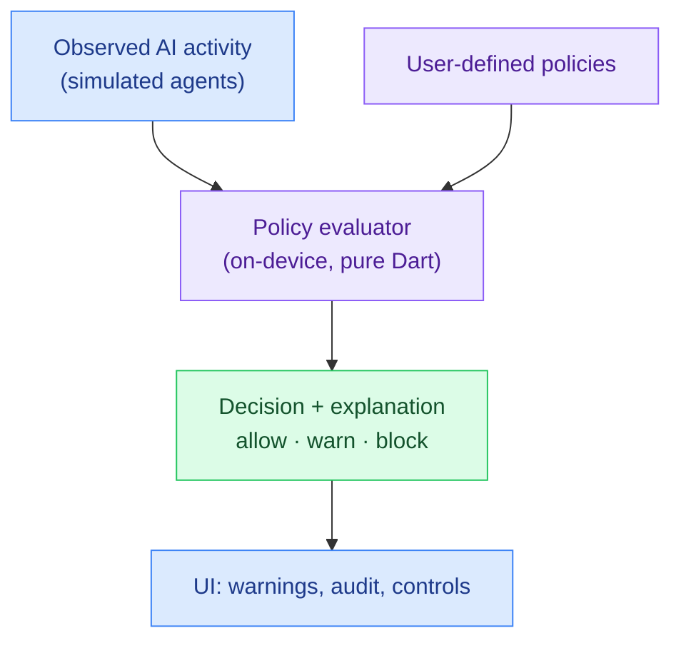

# PolicyLens

**▶ Live demo: https://parag-labs.github.io/policy-lens/** — a Flutter app running on the web
(also runs natively via `flutter run`). Everything runs on-device; no backend, no telemetry.

A personal **AI governance layer** for your phone. As on-device AI agents proliferate, PolicyLens
watches what they try to do — read your contacts, send your photos, check your location — evaluates
each action against **policies you control**, and returns a clear **allow / warn / block** decision
with a plain-language explanation. It keeps a readable audit trail so a non-technical user can see
exactly what happened and why.

Step through the demo one action at a time (or run it all) to watch safe behavior sail through
while an address-book upload gets **blocked**, a location read gets **flagged**, and a burst of
message reads trips a **rate limit**.

---

## Why

Personal AI agents are arriving fast, and users have almost no visibility or control over what they
do with private data. There is no polished, open, *on-device* governance layer for personal AI.
PolicyLens is a small, testable engine for exactly that: observe, evaluate against user policy,
explain, and intervene softly.

## Core idea

The engine lives in `lib/core/policy.dart` as a deterministic evaluator with **no Flutter
dependency**, so every rule is unit-tested:

```
observed AgentAction → evaluate against policies → allow / warn / block + explanation → audit trail
```

- **Policies are simple and declarative.** A policy filters on capability (read / send / act /
  sensor) and data scope (contacts, location, photos, health, messages), and yields a decision.
  A `null` filter means "any".
- **Strictest-wins.** Every matching policy is considered and the most severe decision (`allow` <
  `warn` < `block`) is chosen — so a broad "warn on reads" and a specific "block reading health"
  compose correctly.
- **Rate limits catch bursts.** A policy can allow an action normally but escalate to a warning
  once an agent exceeds *N* matching actions within a time window — per-agent and time-bounded.
- **Everything is explained and audited.** Each verdict carries a human-readable reason and lands
  in an append-only audit trail; there's no deny-by-default black box.

## Architecture



## Demo

```bash
flutter run -d chrome     # web
flutter run               # a device / simulator
```

A scripted stream of eight agent actions mixes clearly-safe reads with a blocked contacts upload, a
warned location read, a blocked photo auto-upload, and a message-read burst that trips the rate
limit — showing both **safe** and **flagged** AI behavior, exactly as the spec asks.

## Design decisions

- **Observe-and-explain, not deny-by-default.** This layer governs agents the user already runs; an
  unmatched action is allowed *with a clear reason*, not silently dropped.
- **Composable severity.** Overlapping policies resolve by strictest-wins so users can layer broad
  and specific rules without ordering surprises.
- **Soft interventions.** `warn` is a heads-up the user can act on; the engine surfaces *why* rather
  than making the choice for them.
- **Readable by a human.** Every verdict is a sentence, and the audit trail is the source of truth —
  the design goal is that a non-technical user understands it at a glance.

## Testing

`flutter test` — 10 tests covering: policy matching (null = any, capability+scope), allow / warn /
block decisions with citations, strictest-wins composition, rate-limit escalation (per-agent,
time-bounded, only after the cap), audit ordering, and a deterministic demo scenario that asserts
the exact safe-vs-flagged outcomes.

```bash
flutter test
```

## Roadmap

- Real observation hooks (accessibility events, OS permission brokers, agent SDK middleware)
  behind the `AgentAction` seam.
- A policy editor UI and shareable, open policy packs.
- Richer interventions: one-tap revoke, quarantine, and per-agent budgets.

## Layout

```
policy-lens/
├── lib/
│   ├── core/
│   │   ├── policy.dart    # pure Dart: policies, evaluator, audit trail (unit-tested)
│   │   └── samples.dart   # deterministic policies + scripted agent activity
│   └── main.dart          # governance dashboard: policies, step-through, audit trail
├── test/                  # 10 flutter_test unit tests
└── web/
```

## License

MIT — see [LICENSE](LICENSE).
